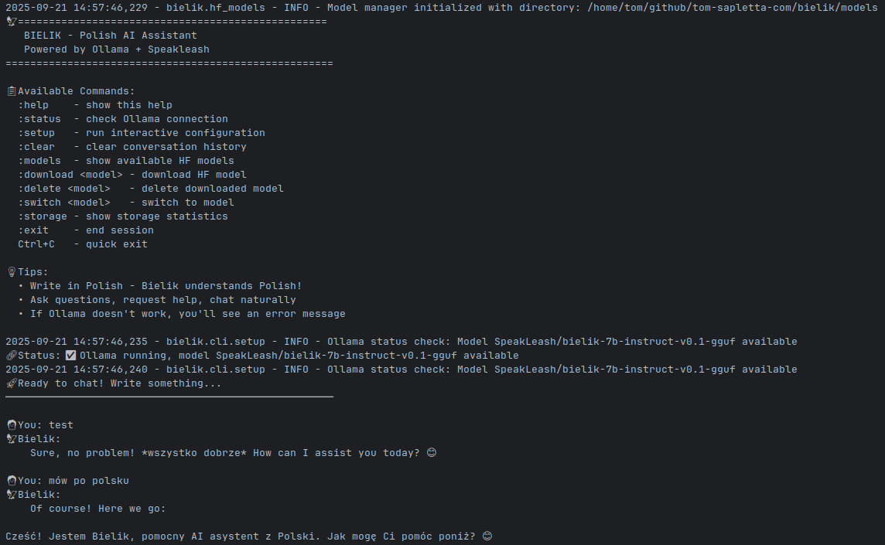

# 🦅 Bielik

[](https://pypi.org/project/bielik/)
[](https://www.python.org/)
[](LICENSE)
[](https://github.com/tomsapletta/bielik/actions)
[](https://pypi.org/project/bielik/)
[](https://flake8.pycqa.org/)
[](https://github.com/tomsapletta/bielik/issues)
[](https://github.com/tomsapletta/bielik/stargazers)
[](https://github.com/tomsapletta/bielik/network)

**Author:** Tom Sapletta  
**License:** Apache-2.0

> 🇵🇱 **Bielik** is a powerful Polish AI Assistant that downloads and runs **[Polish language models](https://huggingface.co/speakleash)** from **[HuggingFace](https://huggingface.co)**, created specifically for the **[Bielik](https://huggingface.co/speakleash)** models from **[Speakleash](https://speakleash.org/)**.

**🚀 Key Features:**
- 🎯 **HuggingFace Integration** - Direct model downloads from HF Hub
- 💬 **Polish Language Optimized** - Built for Polish conversation and analysis  
- 🖼️ **Vision Capabilities** - Image analysis and visual question answering
- 📁 **Document Processing** - PDF, DOCX, web content analysis
- 🐳 **Docker Ready** - Containerized testing environments
- ⚡ **Lightweight** - Minimal (~50MB) or Full (~2GB) installation options

---

## 🏗️ Architecture

```
┌─────────────────────────────────────────────────────────────────┐
│                       🦅 BIELIK SYSTEM                          │
├─────────────────────┬───────────────────────┬───────────────────┤
│   🖥️  CLI Shell     │  🌐 FastAPI Server   │  🐳 Docker Tests   │
│  ┌─────────────────┐│ ┌───────────────────┐ │ ┌───────────────┐ │
│  │ • Interactive   ││ │ • REST /chat      │ │ │ • Minimal     │ │
│  │ • Personalized  ││ │ • WebSocket /ws   │ │ │ • Full        │ │
│  │ • Multi-modal   ││ │ • Port 8000       │ │ │ • CI/CD       │ │
│  └─────────────────┘│ └───────────────────┘ │ └───────────────┘ │
└─────────────────────┴───────────────────────┴───────────────────┘
            │                       │                       │
            ▼                       ▼                       ▼
┌───────────────────────────────────────────────────────────────┐
│                🤗 HUGGINGFACE INTEGRATION                     │
│  ┌──────────────────────┐    ┌─────────────────────────────┐  │
│  │   Direct Downloads   │◄──►│     Local Model Execution   │  │
│  │ ┌─ HF Hub API        │    │ ┌─ Transformers Pipeline    │  │
│  │ └─ Model Management  │    │ └─ Vision Models (optional) │  │
│  └──────────────────────┘    └─────────────────────────────┘  │
└─────────────────────┬─────────────────────────────────────────┘
                      ▼
┌───────────────────────────────────────────────────────────────┐
│                 📚 POLISH LANGUAGE MODELS                      │
│  ┌─────────────────────────────────────────────────────────┐  │
│  │ 🤖 Speakleash/Bielik Models (HuggingFace Hub)          │  │
│  │ 🔗 Direct: HuggingFace → Local Storage → Execution     │  │
│  │ 🎯 Polish-optimized conversation and analysis          │  │
│  └─────────────────────────────────────────────────────────┘  │
└───────────────────────────────────────────────────────────────┘
```



## 🤖 About Bielik Model

**Bielik** is a groundbreaking Polish language model created by **[Speakleash](https://speakleash.org/)** - a foundation dedicated to the development of Polish artificial intelligence.

### 🔗 External Dependencies & Links:
- **[HuggingFace Hub](https://huggingface.co)** - Primary source for Polish language models
- **[Bielik Models on HuggingFace](https://huggingface.co/speakleash)** - Official model repository
- **[Speakleash Foundation](https://speakleash.org/)** - Creators of the Bielik models
- **[Polish AI Initiative](https://www.gov.pl/web/ai)** - Government support for Polish AI

### 🚀 How it Works:
1. **Bielik CLI** connects directly to **HuggingFace Hub**
2. **Models** are downloaded from **Speakleash** organization on HuggingFace
3. **Local execution** uses **Transformers** library (optional for vision)
4. **Chat interface** (CLI/Web) → **Local Models** → **Polish responses**
5. **Modular design** supports text-only or full vision capabilities

---

## 📌 Features

- **🎯 HuggingFace Integration** — Direct model downloads and management
  - **🔍 Model Discovery** — Browse available Polish language models
  - **📦 Smart Downloads** — Automatic model caching and versioning
  - **🚀 Auto-Switch** — Automatically switches to newly downloaded models
  - **🛠️ Interactive** — User-friendly model selection on first startup
- **🖥️ Enhanced CLI** `python -m bielik` — Personalized chat experience
  - **📋 Commands** — `:help`, `:models`, `:download`, `:delete`, `:switch`, `:settings`, `:name`
  - **⚙️ Personalization** — Custom user names, dynamic assistant names
  - **🤗 HF Management** — Direct HuggingFace model operations
  - **📁 Content Analysis** — Folder scanning, document processing
  - **🌍 Cross-platform** — Windows, macOS, Linux support
- **🖼️ Vision Capabilities** (Full version only)
  - **🔍 Image Analysis** — Automatic image captioning in Polish
  - **❓ Visual QA** — Ask questions about images
  - **🎨 Multi-modal** — Combined text and image understanding
  - **⚡ GPU Support** — Hardware acceleration for faster processing
- **🐍 Python API** — Programmatic access via `BielikClient` class
  - **💬 Chat methods** — `chat()`, `query()`, conversation management
  - **🔧 Model control** — Download, switch, and manage models
  - **🤗 HF Models** — Full HuggingFace integration
  - **📤 Export** — Conversation history in multiple formats
- **🌐 Web Server** (FastAPI on port 8000):  
  - **📡 REST** — `POST /chat` endpoint for JSON communication
  - **⚡ WebSocket** — `WS /ws` for real-time chat
  - **🖼️ Multi-modal** — Support for text and image inputs
- **🐳 Docker Support** — Complete containerized testing
  - **📦 Minimal Version** — Lightweight text-only container (~50MB)
  - **🎯 Full Version** — Complete vision-enabled container (~2GB)
  - **🔧 CI/CD** — Automated testing environments  

---

## ⚙️ Installation Options

Bielik offers **two installation modes** to suit different needs:

### 🪶 **Minimal Version** (Recommended for most users)

**~50MB installation** - Perfect for text-based Polish AI conversations:

```bash
# Install minimal version (text-only)
pip install bielik

# Start CLI and download your first model
python -m bielik
```

**What's included:**
- ✅ Polish conversation and text analysis
- ✅ HuggingFace model downloads and management  
- ✅ Document processing (PDF, DOCX, TXT)
- ✅ Web content analysis
- ✅ Folder structure analysis
- ✅ Personalized CLI experience
- ❌ Image analysis (can be added later)

### 🎯 **Full Version** (For image analysis)

**~2GB+ installation** - Complete AI assistant with vision capabilities:

```bash
# Install full version (text + vision)
pip install bielik[vision]

# Start CLI with image analysis support
python -m bielik
```

**What's included:**
- ✅ **Everything from minimal version**
- ✅ **Image analysis and captioning**
- ✅ **Visual question answering**
- ✅ **GPU acceleration support**
- ✅ **Multi-modal document processing**

### 🔄 **Upgrade Anytime**

Start minimal and upgrade when needed:

```bash
# Upgrade minimal → full
pip install bielik[vision]

# Or install specific optional features
pip install bielik[local]    # Local model execution
pip install bielik[gpu]      # GPU acceleration
pip install bielik[dev]      # Development tools
```

---

## 🚀 Quick Start Guide

### 🎯 **Instant Start** (No setup required!)

Bielik now works **without any external dependencies**. Just install and start chatting:

```bash
# Install minimal version
pip install bielik

# Start CLI and choose your first model
python -m bielik
```

**What happens on first run:**
- 🔍 **Model Selection** — Choose from available Polish models
- 📥 **Auto Download** — Selected model downloads from HuggingFace
- 🔄 **Auto Switch** — Automatically switches to the new model
- 💬 **Ready to Chat** — Start conversing in Polish immediately!

### 📱 **Choose Your Experience**

#### 🪶 **Minimal Setup** (Recommended)
Perfect for text conversations and document analysis:
```bash
# 1. Install
pip install bielik

# 2. Start and download your first model
python -m bielik
:download speakleash/bielik-4.5b-v3.0-instruct

# 3. Start chatting in Polish!
Cześć! Jak mogę Ci pomóc?
```

#### 🎯 **Full Setup** (For image analysis)
Includes vision capabilities for image analysis:
```bash
# 1. Install with vision support
pip install bielik[vision]

# 2. Start and download models
python -m bielik
:download speakleash/bielik-4.5b-v3.0-instruct

# 3. Analyze images
Przeanalizuj to zdjęcie: image.jpg
```

#### 🐳 **Docker Setup** (For testing)
Use Docker for isolated testing environments:
```bash
# Clone repository
git clone https://github.com/tomsapletta/bielik.git
cd bielik

# Test minimal version
docker-compose --profile minimal up bielik-minimal

# Test full version  
docker-compose --profile full up bielik-full
```

---

## 💻 Usage

### 🖥️ CLI Commands & Options

#### Starting Bielik

```bash
# Basic usage
python -m bielik                         # Start interactive chat
bielik                                   # Alternative (if in PATH)

# Advanced options  
python -m bielik --help                  # Show all options
```

#### Interactive Commands (inside chat session)

**📋 Model Management:**
```bash
:models                    # List available HuggingFace models
:download <model-name>     # Download model from HuggingFace
:switch <model-name>       # Switch to downloaded model
:delete <model-name>       # Delete model from local storage
```

**⚙️ Personalization:**
```bash
:name <your-name>          # Set your display name
:settings                  # Show current configuration
```

**🛠️ Utilities:**
```bash
:help                      # Show all commands
:clear                     # Clear conversation history
:exit                      # Quit (or Ctrl+C)
```

#### Usage Examples

**First Time Setup:**
```bash
$ python -m bielik
# Choose from recommended models:
# 1. speakleash/bielik-4.5b-v3.0-instruct (Recommended)
# 2. speakleash/bielik-7b-instruct-v0.1
# Enter choice: 1

🔄 Downloading speakleash/bielik-4.5b-v3.0-instruct...
✅ Model ready! Switching to bielik-4.5b-v3.0-instruct

👤 You: Cześć! Jak się masz?
🤖 bielik-4.5b: Cześć! Mam się dobrze, dziękuję...
```

**Everyday Usage:**
```bash
👤 You: :name Jan
✅ Display name set to: Jan

👤 Jan: Przeanalizuj folder ~/dokumenty
🤖 bielik-4.5b: [Analyzes folder structure and contents]

👤 Jan: Opisz to zdjęcie: vacation.jpg  # (Full version only)
🤖 bielik-4.5b: [Describes image in Polish]
```

### 🐍 Python API

Use Bielik programmatically in your Python applications:

```python
from bielik.client import BielikClient

# Create client (auto-downloads model if needed)
client = BielikClient()

# Send a Polish message
response = client.chat("Napisz krótki wiersz o Polsce")
print(response)

# Get model status
status = client.get_status()
print(f"Current model: {status['current_model']}")
print(f"Models available: {status['models_available']}")

# Export conversation
history = client.export_conversation(format="markdown")
```

**Quick functions:**
```python
from bielik.client import quick_chat

# One-off Polish query
response = quick_chat("Co to jest sztuczna inteligencja?")
print(response)
```

**BielikClient Options:**
- `model`: Specific HuggingFace model to use
- `auto_download`: Auto-download model if missing (default: True)

### 🌐 Web Server

```bash
# Start web server
uvicorn bielik.server:app --port 8000

# Or with Docker
docker-compose --profile minimal up bielik-minimal
```

**Endpoints:**
- `POST /chat` - JSON chat endpoint
- `WS /ws` - WebSocket real-time chat
- `GET /models` - List available models

**Example request:**
```json
{"messages": [{"role":"user","content":"Cześć! Jak się masz?"}]}
```

### 🐳 Docker Usage

**Quick Testing:**
```bash
# Test minimal version
docker run -it bielik:minimal

# Test full version with GPU
docker run --gpus all -it bielik:full
```

**With persistent storage:**
```bash
# Minimal with model persistence
docker run -it -v $(pwd)/models:/app/models bielik:minimal

# Full with models and images
docker run -it \
  -v $(pwd)/models:/app/models \
  -v $(pwd)/images:/app/images \
  bielik:full
```

**Development setup:**
```bash
# Clone and test
git clone https://github.com/tomsapletta/bielik.git
cd bielik

# Run automated tests
docker-compose --profile test up test-runner

# Interactive development
docker-compose --profile minimal run --rm bielik-minimal bash
```

---

## 🔧 Environment Variables

**Core Settings:**
* `BIELIK_CLI_USERNAME` — Your display name in CLI (auto-detected from system)
* `BIELIK_CLI_CURRENT_MODEL` — Currently selected model
* `BIELIK_CLI_ASSISTANT_NAME` — Assistant display name (auto-set from model)
* `BIELIK_CLI_AUTO_SWITCH` — Auto-switch to newly downloaded models (default: true)

**Storage & Cache:**
* `BIELIK_MODELS_DIR` — Local model storage directory
* `BIELIK_DATA_DIR` — User data and settings directory
* `HF_HOME` — HuggingFace cache directory

**Docker Environment:**
* `BIELIK_MODE` — `minimal` or `full` (Docker only)
* `BIELIK_IMAGES_DIR` — Images directory for analysis (full version)

---

## 🛠️ Troubleshooting

### Installation Issues

**Problem:** Minimal version works but vision features don't
```bash
# Upgrade to full version
pip install bielik[vision]

# Verify vision packages
python -c "import PIL, transformers; print('Vision packages OK')"
```

**Problem:** Model download fails or times out
```bash
# Check HuggingFace connectivity
python -c "from huggingface_hub import HfApi; print('HF connection OK')"

# Check available disk space (models are 2-8GB)
df -h

# Manual download with timeout
:download speakleash/bielik-4.5b-v3.0-instruct
```

**Problem:** "No models available" on first startup
```bash
# Download a model manually
python -m bielik
:models
:download speakleash/bielik-4.5b-v3.0-instruct
```

### Runtime Issues

**Problem:** Model responses are slow or use too much memory
```bash
# Use smaller model
:switch speakleash/bielik-4.5b-v3.0-instruct  # instead of 7b

# Check system resources
htop      # Linux/macOS
taskmgr   # Windows

# Enable GPU acceleration (full version)
pip install bielik[gpu]
```

**Problem:** Image analysis not working
```bash
# Check if vision packages installed
python -c "from bielik.image_analyzer import ImageAnalyzer; ia = ImageAnalyzer(); print(f'Available: {ia.is_available()}')"

# Install vision support
pip install bielik[vision]
```

**Problem:** CLI settings not persisting
```bash
# Check .env file creation
ls -la ~/.bielik/ || ls -la ./

# Reset settings
:name YourName
:settings
```

### Docker Issues

**Problem:** Docker containers fail to start
```bash
# Build images manually
docker build -f docker/Dockerfile.minimal -t bielik:minimal .
docker build -f docker/Dockerfile.full -t bielik:full .

# Check container logs
docker logs bielik-minimal
```

**Problem:** Models not persisting between Docker runs
```bash
# Use volume mounts
docker run -v $(pwd)/models:/app/models bielik:minimal

# Or use Docker Compose
docker-compose --profile minimal up
```

### Getting Help

- **GitHub Issues:** [Report bugs and feature requests](https://github.com/tomsapletta/bielik/issues)
- **Command Help:** `python -m bielik --help` or `:help` in CLI
- **Test Environment:** Use Docker for isolated testing
- **Check Status:** Use `:settings` command for current configuration

---

## 📝 Development

```bash
git clone https://github.com/tomsapletta/bielik.git
cd bielik
python -m venv .venv
source .venv/bin/activate
pip install -e .[ollama]
```


# 📂 Package Structure

```
bielik/
├── bielik/
│   ├── __init__.py          # Package initialization
│   ├── cli.py               # CLI entry point (wrapper)
│   ├── client.py            # Client entry point (wrapper)
│   ├── server.py            # FastAPI web server
│   ├── config.py            # Configuration management
│   ├── hf_models.py         # Hugging Face model management
│   ├── content_processor.py # Content processing utilities
│   ├── cli/                 # Modular CLI components
│   │   ├── __init__.py
│   │   ├── main.py          # Main CLI entry and argument parsing
│   │   ├── commands.py      # Command processing and execution
│   │   ├── models.py        # HF model management CLI
│   │   ├── setup.py         # Interactive setup manager
│   │   └── send_chat.py     # Chat communication handling
│   └── client/              # Modular client components
│       ├── __init__.py      # Client package exports
│       ├── core.py          # Core BielikClient class
│       ├── model_manager.py # HF model operations for client
│       └── utils.py         # Client utility functions
├── tests/
│   ├── __init__.py
│   ├── test_cli.py          # CLI unit tests
│   └── test_server.py       # Server unit tests
├── pyproject.toml           # Modern Python packaging
├── setup.cfg                # Package configuration
├── MANIFEST.in              # Package manifest
├── LICENSE                  # Apache 2.0 license
├── README.md                # This documentation
├── Makefile                 # Development automation
├── todo.md                  # Project specifications
└── .github/workflows/       # CI/CD automation
    └── python-publish.yml
```


## 📜 License

[Apache License 2.0](LICENSE)


